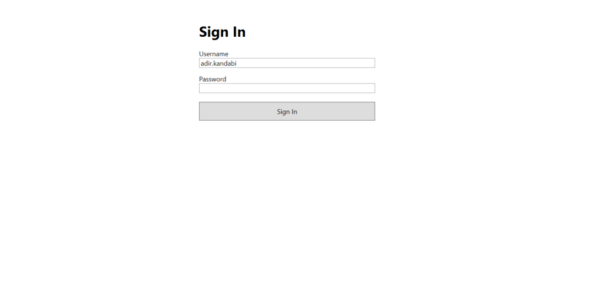
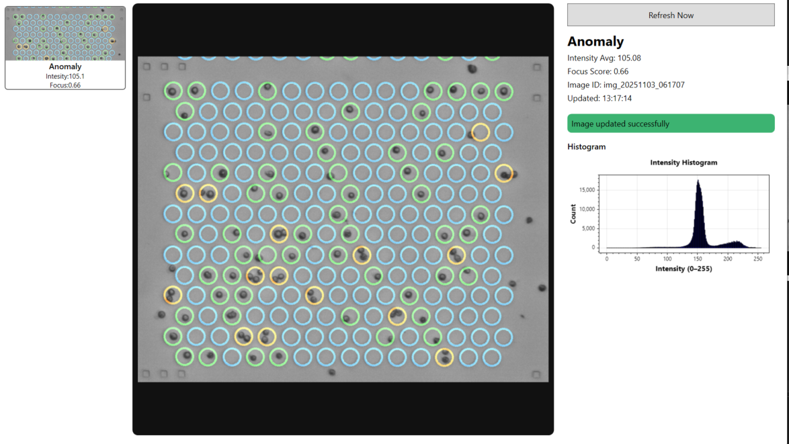
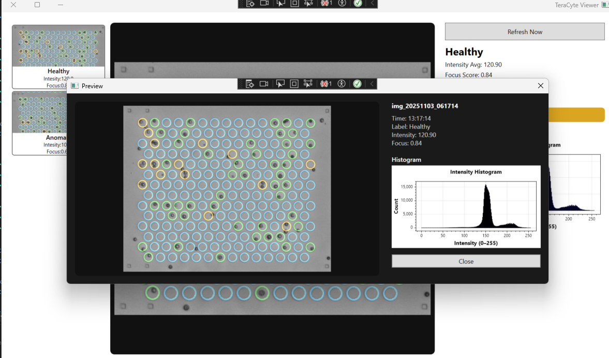

# 🧬 TeraCyte Viewer

**A real-time WPF application for streaming microscope images and AI inference results from the TeraCyte backend.**  
Built with **.NET 8**, **MVVM**, and **WPF**, featuring JWT authentication, automatic token refresh, live polling, and a modern responsive UI.

---

## 🚀 Overview

TeraCyte Viewer connects to the TeraCyte assignment API to:

- Authenticate users via JWT tokens
- Poll protected endpoints for real-time microscope images and inference results
- Display live image data, metrics, and histograms
- Handle token refreshes, stale data, and API failures gracefully
- Maintain a scrollable history of previously fetched images
- Provide smooth animations

---

## 🧩 Architecture

```
TeraCyteViewer
│
├── Models/
│ ├── ImageResponse.cs // /api/image DTO
│ ├── ResultsResponse.cs // /api/results DTO
│ └── ImageResultItem.cs // History item (image + metrics)
│
├── Services/
│ ├── AuthService.cs // JWT login, refresh, expiry logic
│ ├── ApiClient.cs // Fetches images & results with auto retry
│ ├── PollingService.cs // Periodic data fetching and stale handling
│ ├── NavigationService.cs // Switches between views (Login ↔ Live)
│
├── ViewModels/
│ ├── LoginViewModel.cs // Authentication logic and commands
│ ├── LiveViewModel.cs // Main logic for image/results/history
│ ├── MainViewModel.cs // High-level app state
│
├── Views/
│ ├── LoginView.xaml // Login UI
│ ├── LiveView.xaml // Main real-time view
│ ├── HistogramView.xaml // ScottPlot histogram component
│ ├── HistoryPreviewWindow.xaml // Popup preview for past images
│
├── Utils/
│ ├── ImageHelper.cs // Base64 → BitmapImage converter
│ ├── Converters.cs
│
└── App.xaml / App.xaml.cs // DI setup, logging, exception handling
```

---

## 🧠 Key Features

| Category          | Description                                                                       |
| ----------------- | --------------------------------------------------------------------------------- |
| 🔑 Authentication | Login with username/password, manage JWT, auto-refresh tokens before expiry       |
| 🔄 Token Refresh  | On `401 Unauthorized`, refresh tokens and retry once before logout                |
| 🕑 Polling        | Background polling of `/api/image` and `/api/results` every few seconds           |
| 🧩 Data Pairing   | Only update when a **new image_id** appears, ensuring matched image/result pairs  |
| 📊 Visualization  | Live histogram rendered with **ScottPlot.WPF** (256 bins, intensity counts)       |
| 🧱 State Handling | Graceful handling of stale data, API timeouts, unknown classifications            |
| 🗂 History         | Scrollable history panel with clickable previews of previous results              |
| ✨ UI/UX          | Animated fade & zoom-in transitions, color-coded status, overlay messages         |
| 🧾 Logging        | Detailed logging via **Serilog** (Auth, API, refresh, polling, errors)            |
| 💥 Error Recovery | Automatic retries for transient 5xx errors, logout on unrecoverable auth failures |

---

## 🧰 Tech Stack

- **.NET 8 / WPF**
- **MVVM Toolkit** (`CommunityToolkit.Mvvm`)
- **Serilog** for logging
- **ScottPlot.WPF** for chart visualization
- **Dependency Injection** via `Microsoft.Extensions.Hosting`
- **Async/await + CancellationTokens** for robust async flow

---

## 🧭 App Flow

### **1️⃣ LoginViewModel → LoginView**

- User enters credentials and authenticates.
- On success, access and refresh tokens are stored securely.
- Navigation automatically switches to the **LiveView** screen.

---

### **2️⃣ PollingService**

- Runs in the background, calling the API every few seconds:
  - `GET /api/image`
  - `GET /api/results`
- Detects when a **new `image_id`** appears.
- Fetches and pairs the image with its matching results.
- Notifies the **LiveViewModel** of updates.

---

### **3️⃣ LiveViewModel**

- Updates observable properties:
  - `CurrentImage`
  - `ClassificationLabel`
  - `IntensityAverage`
  - `FocusScore`
  - `Histogram`
- Adds a new entry to the **History** collection.
- Updates UI state:
  - Status messages
  - Brush color (green/yellow/red)
  - Overlay messages
- Triggers subtle animations for smooth transitions.

---

### **4️⃣ LiveView**

- Displays the current microscope image and inference results.
- Shows a **live histogram** (ScottPlot) for intensity distribution.
- Provides a **scrollable history panel** of previous images.
- Supports click events on history items:
  - Opens a **HistoryPreviewWindow** popup to view full details (image, metrics, histogram).

---

## ⚙️ Setup & Run

### Prerequisites

- [.NET 8 SDK](https://dotnet.microsoft.com/download/dotnet/8.0)

### Clone & Restore

```bash
git clone https://github.com/adirkandabi/TeraCyteViewer.git
cd TeraCyteViewer
dotnet restore
```

### Run

```
dotnet run --project TeraCyteViewer
```

Or directly from Visual Studio (F5)

## 📸 Screenshots

### Login View



### Live View



### History Window View


